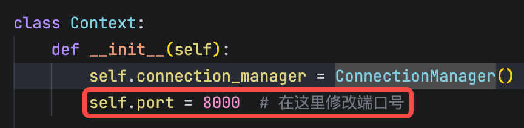

## 部署流程

**若想修改端口号，只需在 Context 类中修改 port 字段：**



### macos/linux 系统

1. git clone 本代码仓库
2. 在电脑中安装 python、uv（pip install uv）
3. cd backend
4. uv sync
5. 激活 uv 环境：
   a. cd backend
   b. source .venv/bin/activate
6. cd src
7. python main.py

### windows 系统

1. git clone 本代码仓库
2. 在电脑中安装 python、uv（pip install uv）
3. cd backend
4. uv sync
5. 激活 uv 环境：(使用 git bash 环境)
   a. cd backend
   b. source .venv/Scripts/activate
6. cd src
7. python main.py

windows 系统也可以使用 powershell 环境进行 uv 环境激活，使用该命令：.venv\Scripts\Activate.ps1，但 powershell 默认不能运行脚本文件，可参考该文章：https://blog.csdn.net/weixin_41891519/article/details/107151565

## 实验配置文件

实验配置文件位于 `backend/src/cfg/` 目录中，需根据实验配置文件格式定义实验配置。

### 实验配置文件字段说明

| 字段                                               | 说明           | 类型   | 示例值                                                             |
| -------------------------------------------------- | -------------- | ------ | ------------------------------------------------------------------ |
| lab_exp_name                                       | 实验名称       | 字符串 | test                                                               |
| algorithm                                          | 算法配置       | 对象   | `{"class_name": "TestAlgorithm", "module": "algorithm.test_algo"}` |
| algorithm.class_name                               | 算法类名       | 字符串 | TestAlgorithm                                                      |
| algorithm.module                                   | 算法模块路径   | 字符串 | algorithm.test_algo                                                |
| groups                                             | 分组配置       | 数组   | `[{"name": "A", "roles": [...]}, {"name": "B", "roles": [...]}]`   |
| groups[].name                                      | 组名           | 字符串 | A, B                                                               |
| groups[].roles                                     | 角色配置       | 数组   | `[{"name": "统帅", "num": 1}]`                                     |
| groups[].roles[].name                              | 角色名         | 字符串 | 统帅, 参谋                                                         |
| groups[].roles[].num                               | 角色数量       | 整数   | 1                                                                  |
| hint_pics_path                                     | 提示图片路径   | 字符串 | exp/test                                                           |
| hint_pics                                          | 提示图片列表   | 数组   | `["1.png", "2.png"]`                                               |
| main_rounds                                        | 大回合配置     | 数组   | `[{"repeat": 1, "sub_rounds": [...]}]`                             |
| main_rounds[].repeat                               | 大回合重复次数 | 整数   | 1                                                                  |
| main_rounds[].sub_rounds                           | 小回合配置     | 数组   | （包含多个小回合配置）                                             |
| main_rounds[].sub_rounds[].decision                | 决策配置       | 对象   | `{"makers": [...], "options": [...]}`                              |
| main_rounds[].sub_rounds[].decision.makers         | 决策者配置     | 数组   | `[{"roles": ["统帅"]}]`                                            |
| main_rounds[].sub_rounds[].decision.makers[].roles | 决策者角色列表 | 数组   | `["统帅", "参谋"]`                                                 |
| main_rounds[].sub_rounds[].decision.options        | 决策选项列表   | 数组   | `["购买", "不购买"]`                                               |
| main_rounds[].sub_rounds[].hint                    | 提示信息       | 字符串 | 前一个大回合的派兵分布...                                          |
| main_rounds[].sub_rounds[].repeat                  | 小回合重复次数 | 整数   | 1                                                                  |

## 实验 log

实验 log 位于 `backend/log/` 目录中，每个实验会生成一个 log 目录，目录名与实验名称相同，实验名称为配置文件中的 lab_exp_name 字段。每个实验 log 目录下会生成一个以时间戳命名的子目录，子目录下会生成两个 json 文件：exp_log_message.json 和 exp_log_decision.json。

### 实验 log 文件格式说明

#### exp_log_decision.json 文件格式

该文件记录了实验过程中所有的决策日志，数据结构为 JSON 数组，每个元素代表一个决策记录。

**数据结构说明：**

```json
[
  {
    "用户ID(UUID)": {
      "role": ["分组名称", "角色名称"],
      "decision": "决策内容"
    }
  }
]
```

**字段说明：**

| 字段          | 说明               | 类型         | 示例值                               |
| ------------- | ------------------ | ------------ | ------------------------------------ |
| 用户 ID(UUID) | 用户唯一标识符     | 字符串(UUID) | c4dbd8a2-55d9-4e5e-86ca-eef07e78995c |
| role          | 用户角色信息       | 数组         | ["A", "统帅"]                        |
| role[0]       | 分组名称           | 字符串       | A                                    |
| role[1]       | 角色名称           | 字符串       | 统帅                                 |
| decision      | 用户做出的决策内容 | 字符串       | 战场 1, 购买                         |

#### exp_log_message.json 文件格式

该文件记录了实验过程中所有的消息日志，包括实验信息更新、提示、选项等内容，数据结构为 JSON 数组，每个元素代表一条消息记录。

**数据结构说明：**

```json
[
  {
    "用户ID(UUID)": {
      "message": {
        "cmd": "消息类型",
        "data": {
          "infos": [{ "hint": "信息提示", "value": "信息值" }],
          "images": [{ "imageUrl": "图片URL" }],
          "options": {
            "options": ["选项1", "选项2"]
          },
          "expStatus": "实验状态"
        }
      }
    }
  }
]
```

**字段说明：**

| 字段                           | 说明           | 类型         | 示例值                                 |
| ------------------------------ | -------------- | ------------ | -------------------------------------- |
| 用户 ID(UUID)                  | 用户唯一标识符 | 字符串(UUID) | c4dbd8a2-55d9-4e5e-86ca-eef07e78995c   |
| message                        | 消息内容       | 对象         | 包含 cmd 和 data 字段                  |
| message.cmd                    | 消息命令类型   | 字符串       | UPDATE_EXPERIMENT_INFO                 |
| message.data                   | 消息数据       | 对象         | 包含实验信息相关数据                   |
| message.data.infos             | 实验信息列表   | 数组         | 包含多条信息提示和值                   |
| message.data.infos[].hint      | 信息提示文本   | 字符串       | 实验轮数, 前一个大回合我军得分#...     |
| message.data.infos[].value     | 信息对应的值   | 字符串       | 1/1, 10                                |
| message.data.images            | 图片列表       | 数组         | 包含图片 URL 的对象列表                |
| message.data.images[].imageUrl | 图片 URL 地址  | 字符串       | http://192.168.31.88:8000/images/1.png |
| message.data.options           | 选项配置       | 对象         | 包含 options 字段                      |
| message.data.options.options   | 可选项列表     | 数组         | ["战场 1", "战场 2"]                   |
| message.data.expStatus         | 实验状态       | 字符串       | RUNNING                                |
